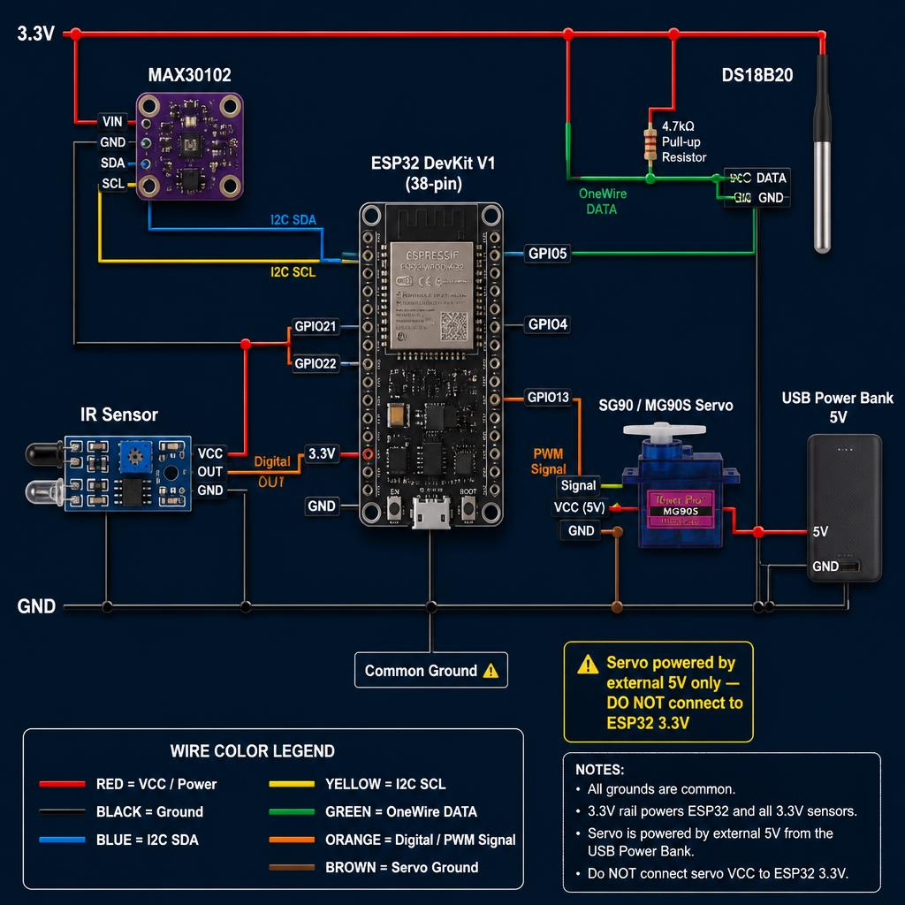

# Robotic Hand Vitals Monitor

> ESP32-based 3D-printed robotic forearm that detects hand placement, measures vital signs (heart rate, SpO₂, temperature), publishes results to Adafruit IO, and auto-releases — built for academic evaluation.

---

## Circuit Diagram



---

## Demo Flow

```
IDLE → detect hand (IR sensor) → FOLD fingers (servo)
     → MEASURE vitals (MAX30102 + DS18B20)
     → PUBLISH to Adafruit IO dashboard
     → HOLD 5 s → UNFOLD → IDLE
```

---

## Hardware

| Component | Part | Connection |
|---|---|---|
| Microcontroller | ESP32 DevKit V1 (38-pin) | — |
| Pulse Oximeter | MAX30102 module | I2C: SDA→GPIO21, SCL→GPIO22 |
| Hand Detection | IR proximity sensor | Digital OUT → GPIO4 |
| Finger Actuator | SG90 / MG90S servo | Signal → GPIO13 |
| Skin Temperature | DS18B20 waterproof | OneWire → GPIO5 (+ 4.7kΩ) |

> ⚠️ **Servo power**: Use an external 5V supply (USB power bank recommended). Do NOT power the servo from the ESP32's onboard regulator. Connect GND from the external supply to ESP32 GND.

---

## Software Stack

- **Framework**: Arduino on ESP32 (Arduino IDE with esp32 by Espressif v2.0.17)
- **Cloud**: Adafruit IO (MQTT) — 3 feeds: `heart_rate`, `spo2`, `temperature`

### Required Libraries (install via Arduino Library Manager)

| Library | Version |
|---|---|
| SparkFun MAX3010x Pulse and Proximity Sensor Library | 1.1.2 |
| ESP32Servo | 0.13.0 |
| Adafruit IO Arduino | 4.2.9 |
| Adafruit MQTT Library | 2.5.6 |
| ArduinoHttpClient | 0.6.1 |
| DallasTemperature | 3.9.0 |
| OneWire | 2.3.7 |

---

## Project Structure

```
ROBOTICARM/
├── RoboticHandVitals/
│   ├── RoboticHandVitals.ino   ← Main sketch (state machine)
│   ├── config.h                ← ⚠️ Credentials & pin/tuning config (edit this first)
│   ├── vitals.h / .cpp         ← MAX30102 + DS18B20 read & average
│   ├── servo_control.h / .cpp  ← Soft-start servo ramp
│   ├── ir_sensor.h / .cpp      ← Debounced IR hand detection
│   └── adafruit_io_helper.h/.cpp ← WiFi + Adafruit IO publish
├── .gitignore
└── README.md
```

---

## Setup

### 1. Configure credentials
Edit `RoboticHandVitals/config.h` and fill in:
```cpp
#define WIFI_SSID     "your_network_name"
#define WIFI_PASSWORD "your_password"
#define AIO_USERNAME  "your_adafruit_io_username"
#define AIO_KEY       "your_adafruit_io_key"
```

### 2. Create Adafruit IO feeds
Go to [io.adafruit.com](https://io.adafruit.com) → Feeds → New Feed. Create:
- `heart_rate`
- `spo2`
- `temperature`

Then create a dashboard with 3 Gauge blocks, one per feed.

### 3. Arduino IDE board settings
- Board: **ESP32 Dev Module**
- Upload Speed: 115200
- Flash Size: 4MB
- Partition Scheme: Default

### 4. Upload
- Select the correct COM port
- Click **Upload**
- Open Serial Monitor at **115200 baud** to watch state transitions

---

## Pin Map Summary

```
ESP32 GPIO4   ← IR sensor OUT
ESP32 GPIO5   ← DS18B20 DATA (+ 4.7kΩ to 3.3V)
ESP32 GPIO13  → Servo SIG
ESP32 GPIO21  ↔ MAX30102 SDA
ESP32 GPIO22  ↔ MAX30102 SCL
```

---

## Tuning

All tunable constants are in `config.h`:

| Constant | Default | Effect |
|---|---|---|
| `SERVO_OPEN_DEG` | 0° | Finger open position |
| `SERVO_CLOSE_DEG` | 70° | Finger close position — increase for tighter grip |
| `SERVO_STEP_DELAY_MS` | 15 ms | Ramp speed — higher = slower/gentler |
| `IR_DEBOUNCE_MS` | 200 ms | Hand detection sensitivity |
| `MEASURE_SAMPLES` | 3 | Readings per cycle |
| `HOLD_DURATION_MS` | 5000 ms | How long fingers stay closed post-measurement |
| `FAILSAFE_TIMEOUT_MS` | 30000 ms | Max time before auto-release |

---

## Fail-Safe

If any state hangs for longer than `FAILSAFE_TIMEOUT_MS` (default 30 s), the firmware automatically opens the fingers and returns to IDLE. This ensures the hand never stays closed indefinitely even if Wi-Fi or sensor fails.

---

## License

MIT — free for academic and personal use.
