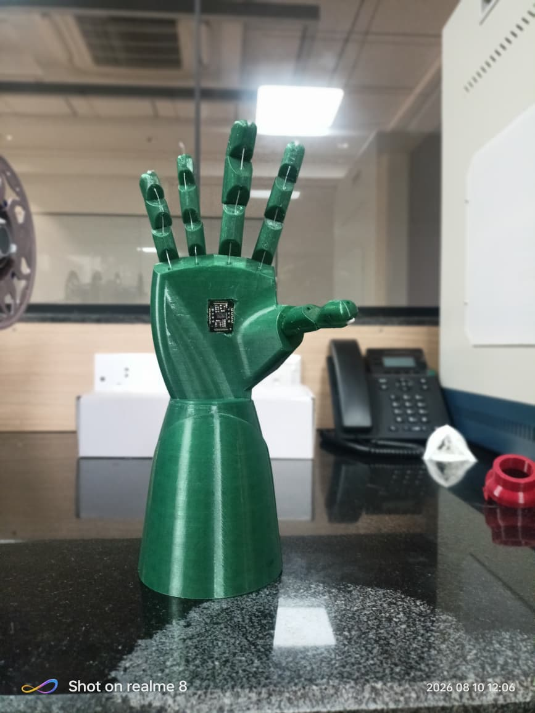
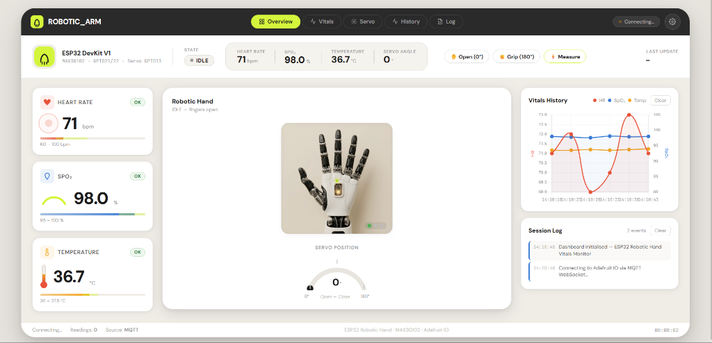
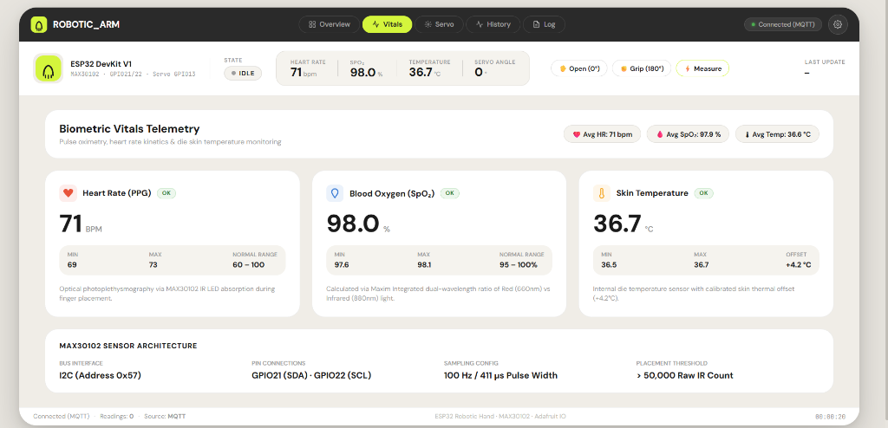

# 🦾 Robotic Hand Vitals Monitor & Control System

> **ESP32-driven 3D-printed robotic hand and biometric monitor.** Features automatic hand-placement detection, live vital signs sensing (Heart Rate, SpO₂, Skin Temperature with +4.2°C thermal offset calibration), direct USB WebSerial / Adafruit IO MQTT telemetry, and a multi-page Web Dashboard interface.

---

## 📷 Physical Hardware Model & Prototype



*Figure 1: Assembled 3D-printed robotic hand with integrated MAX30102 biometric sensor mounted in the palm, tendon actuation assembly, and ESP32 control interface.*

---

## 🖼️ Web Application Dashboard Preview

### 🎛️ Overview Dashboard View


### 🫀 Biometric Vitals Telemetry View


The project includes a feature-rich web application (`/dashboard`) built with HTML5, CSS3, and JavaScript (Chart.js, WebSerial API):

- 🎛️ **Overview Page**: System status strip, real-time vitals cards, 3D hand render state sync, mini time-series chart, and live event log.
- 🫀 **Vitals Detail Page**: Dedicated biometric analytics with Min / Max / Avg stats and MAX30102 sensor architecture specs.
- 🦾 **Servo Kinematics Page**: Interactive 180° servo arc gauge dial, manual position slider, preset angle buttons (0° Open, 90° Mid, 180° Fold), and direct tendon movement controls.
- 📈 **History Analytics Page**: Interactive time-series trends with dataset toggles (HR, SpO₂, Temp), full telemetry record stream table, and **CSV Data Export**.
- 📋 **Session Audit Log Page**: Searchable event console with category filtering pills (All, FSM State, Vitals, Info, Errors) and **Log File Export**.

---

## ⚙️ Key System Features

- **Automatic Hand Detection & FSM Automation**: Uses MAX30102 IR photodiode value (> 50,000 counts) to trigger the finger-closing routine, biometric sampling, hold period, and automatic unfolding.
- **Biometric Calibration & Offsets**: Skin temperature reading calibrated with a +4.2°C thermal offset and continuous pulse oximetry averaging (HR in BPM, SpO₂ %).
- **Direct WebSerial (USB) & Adafruit IO Telemetry**: Full dual-mode connectivity — real-time serial JSON communication via Chrome/Edge WebSerial API (115200 baud) or wireless MQTT streaming to Adafruit IO feeds.
- **Interactive Manual Servo & Kinematics Control**: Send direct JSON commands (`fold`, `unfold`, `measure`, `servo angle`) over USB WebSerial to override or operate the robotic hand manually.
- **Safety Fail-Safe Protection**: Built-in 30-second failsafe timeout (`FAILSAFE_TIMEOUT_MS`) that automatically opens finger tendons if measurement stalls or fails.
- **Secure Credentials System**: Separated `config.example.h` template prevents committing Wi-Fi or Adafruit IO API keys to git repositories.

---

## 🔄 Finite State Machine (FSM) Flow

```
+--------+    IR > 50k    +--------+    Servo 180°    +---------+
|  IDLE  | -------------> |  FOLD  | --------------> | MEASURE |
+--------+                +--------+                  +---------+
    ^                                                      |
    |                                                 Vitals Valid
    |                 +----------+     Timer > 3s     +---------+
    +---------------- | COOLDOWN | <----------------- |  HOLD   |
         Timer > 3s   +----------+    Unfold 0°       +---------+
```

1. **IDLE**: Monitor MAX30102 IR sensor channel. Wait for hand/finger placement (IR value > 50,000).
2. **FOLD**: Drive SG90 / MG90S servo to 180° to flex finger tendons over sensor.
3. **MEASURE**: Collect IR/Red samples, compute Heart Rate (BPM), SpO₂ (%), and calibrated Skin Temp (°C).
4. **HOLD**: Display reading and transmit JSON telemetry (WebSerial & Adafruit IO MQTT).
5. **UNFOLD**: Move servo back to 0° to release finger tendons.
6. **COOLDOWN**: 3-second delay to clear sensor readings before returning to IDLE state.

---

## 🩸 How the Pulse Oximeter Retrieves Data from the Hand

The **MAX30102** sensor uses **Photoplethysmography (PPG)** — a non-invasive optical technique — to measure biometric data from the skin surface. Here is how the process works, step by step:

1. **Sensor Placement Detection**
   - The MAX30102's IR photodiode continuously monitors ambient IR light levels.
   - When a hand/finger is placed on the sensor, the IR reflection value jumps above **50,000 counts** (the `OXIMETER_FINGER_THRESHOLD`).
   - A **debounce timer** (`IR_DEBOUNCE_MS`) ensures the reading is stable before triggering the measurement cycle — preventing false positives from accidental contact.

2. **LED Activation & Light Emission**
   - Once a hand is confirmed, the sensor activates two on-board LEDs: a **Red LED** (~660 nm) and an **Infrared LED** (~880 nm).
   - These LEDs are fired **alternately** at 100 samples/second (`sampleRate = 100`) with a pulse width of **411 µs** to maximize signal quality.
   - LED brightness is set to **60/255** — enough for reliable skin penetration without excessive heat.

3. **Light Absorption & Photodiode Reading**
   - The LEDs shine light **into the skin tissue** of the hand/finger placed over the sensor window.
   - Blood absorbs red and IR light at **different ratios** depending on oxygen saturation (oxygenated vs. deoxygenated hemoglobin).
   - The onboard **photodiode** measures how much light passes through (or reflects back from) the tissue and returns a raw ADC count for each wavelength.

4. **FIFO Buffer Collection**
   - The ESP32 reads **100 raw samples** (`FIFO_SAMPLES_PER_READ`) from the sensor's internal **FIFO hardware buffer** per measurement round.
   - The firmware calls `_sensor.check()` in a tight loop to flush hardware FIFO into a software buffer, then pops each sample using `getRed()` / `getIR()` / `nextSample()`.
   - The FIFO is **cleared before each sample batch** (`clearFIFO()`) to discard stale data from previous cycles.

5. **SpO₂ & Heart Rate Algorithm**
   - The collected `redBuffer[100]` and `irBuffer[100]` arrays are passed to `maxim_heart_rate_and_oxygen_saturation()` — the official **Maxim Integrated (Analog Devices) signal-processing algorithm** bundled with the SparkFun MAX30105 library.
   - This algorithm performs **AC/DC component separation** on the PPG waveform to extract the pulsatile signal and identify heartbeat peaks (BPM).
   - The ratio of **Red AC/DC** to **IR AC/DC** is used to calculate **SpO₂ (%)** using the standard R-curve calibration.
   - Each result comes with a **validity flag** (`hrValid`, `spo2Valid`) and **confidence score** (0–100).

6. **Temperature Reading**
   - Immediately after the optical measurement, the MAX30102's built-in **die thermistor** is read via `readTemperature()`.
   - A **+4.2°C thermal offset** (`TEMP_OFFSET_DEG_C`) is applied to calibrate the raw die temperature to match actual skin surface temperature.

7. **Multi-Sample Averaging & Validation**
   - The entire FIFO-collect → algorithm → temperature cycle is repeated **`MEASURE_SAMPLES` times** with a delay of `MEASURE_INTERVAL_MS` between each round.
   - Each reading is **validated** against physiological plausibility ranges: HR between 40–200 BPM and SpO₂ between 70–100%.
   - Only readings that pass both the library's validity flags **and** the range check are accepted and averaged.
   - The **final output** is the mean HR (BPM), SpO₂ (%), and Skin Temp (°C) across all valid samples.

8. **Telemetry Transmission**
   - Valid averaged vitals are packaged into a **JSON payload** and broadcast over two channels simultaneously:
     - **USB WebSerial** at 115200 baud → received by the Chrome/Edge Web Dashboard in real time.
     - **Adafruit IO MQTT** (Wi-Fi) → streamed to cloud feeds for remote monitoring and history.

---

## 🌐 How the Project Works — End-to-End Overview

This system is a **biometric-enabled robotic hand** that automatically detects when a user places their hand on it, measures their vital signs, and streams the data to a live web dashboard. Here is the complete flow:

- **Hardware Core**: A 3D-printed robotic hand actuated by SG90/MG90S servo motors through a tendon-cable mechanism. An ESP32 microcontroller is the central brain, connected to the MAX30102 sensor via I2C (GPIO 21/22) and the servo via PWM (GPIO 13).

- **Hand Placement Detection**: The MAX30102 IR photodiode passively monitors for a hand — when a user places their palm/finger over the sensor, the IR reflection crosses the detection threshold and a debounced confirmation triggers the automation cycle.

- **Automatic Finger Closing (FOLD State)**: The servo rotates to 180°, pulling the tendon cables to flex the robotic fingers firmly over the user's hand, pressing it gently against the sensor window for a consistent optical reading.

- **Biometric Measurement (MEASURE State)**: The firmware collects multiple rounds of 100 red + IR PPG samples from the MAX30102 FIFO, runs the Maxim SpO₂/HR algorithm, reads skin temperature, validates each result, and averages the accepted readings.

- **Hold & Transmit (HOLD + PUBLISH States)**: The fingers hold position while the averaged HR, SpO₂, and temperature results are packaged as JSON and sent simultaneously over USB WebSerial and Adafruit IO MQTT (if Wi-Fi is enabled).

- **Auto Release (UNFOLD → COOLDOWN States)**: The servo returns to 0° to release the fingers, followed by a cooldown delay to clear the sensor buffers, before the system returns to IDLE and is ready for the next user.

- **Web Dashboard**: A modern HTML5/CSS3/JS single-page app connects via the Chrome/Edge WebSerial API to display live vital signs cards, FSM state sync, Chart.js time-series graphs, servo kinematics control, session audit log, and CSV/log export — all updating in real time over USB with no server required.

- **Fail-Safe**: A 30-second watchdog timeout (`FAILSAFE_TIMEOUT_MS`) in every non-IDLE state guarantees the fingers will automatically open if any step stalls or fails, protecting both the hardware and the user.

---

## 🔌 Hardware Architecture & Pin Map

| Component | Part / Spec | Connection | Function |
|---|---|---|---|
| Microcontroller | ESP32 DevKit V1 (38-pin) | USB / External 5V | Core Controller & Wi-Fi / Serial Gateway |
| Biometric Sensor | MAX30102 Pulse Oximeter & Temp | I2C: SDA → **GPIO21**, SCL → **GPIO22** | Heart Rate, SpO₂, Skin Temperature & IR Hand Detection |
| Tendon Actuator | SG90 / MG90S Servo | Signal → **GPIO13** | PWM Finger Closing / Opening (0° – 180°) |

> ⚠️ **Power Notice**: Tendon servos must be powered by an external 5V power supply with a shared GND line to the ESP32. Do not attempt to drive servos directly from ESP32 development board power rails.

---

## 📂 Repository Structure

```
ROBOTICARM/
├── MODEL.jpeg                    # Photograph of final physical 3D-printed model
├── robotic_hand_render.png       # 3D digital render preview
├── BOM_initial.txt               # Hardware Bill of Materials & printing log
├── Project Description.docx      # Full technical specification & project report
├── 3D Files Robo Hand/           # STL 3D printing files for fingers, palm & base
├── Datasheets/                   # Technical datasheets (MAX30102, ESP32, MG90S)
├── docs/                         # Documentation assets & screenshots
│   └── images/
│       ├── dashboard_overview.png
│       └── dashboard_vitals.png
├── RoboticHandVitals/            # ESP32 C++ Arduino Firmware
│   ├── RoboticHandVitals.ino     # FSM & main loop
│   ├── config.example.h          # Configuration template (pins, Wi-Fi, offsets)
│   ├── vitals.h / vitals.cpp     # MAX30102 sensor driver & algorithms
│   ├── servo_control.h / cpp     # Servo PWM kinematics driver
│   ├── ir_sensor.h / cpp         # Hand placement detection logic
│   └── adafruit_io_helper.h / cpp# Wi-Fi & Adafruit IO MQTT client
└── dashboard/                    # Modern HTML5 / CSS3 / JS Web App
    ├── index.html                # Multi-tab single page interface
    ├── style.css                 # Dark Glassmorphism CSS design system
    ├── app.js                    # WebSerial manager, Chart.js telemetry & FSM sync
    └── assets/                   # Icons & 3D render assets
```

---

## 🛠️ Software Setup & Execution

### 1. ESP32 Firmware Setup (`RoboticHandVitals`)

1. Copy the example configuration template:
   ```bash
   cp RoboticHandVitals/config.example.h RoboticHandVitals/config.h
   ```
2. Edit `RoboticHandVitals/config.h` with your Wi-Fi & Adafruit IO credentials (or set `ENABLE_WIFI 0` for standalone offline mode):
   ```cpp
   #define ENABLE_WIFI   1
   #define WIFI_SSID     "YOUR_WIFI_SSID"
   #define WIFI_PASSWORD "YOUR_WIFI_PASSWORD"
   #define AIO_USERNAME  "YOUR_ADAFRUIT_IO_USERNAME"
   #define AIO_KEY       "YOUR_ADAFRUIT_IO_KEY"
   ```
3. Open `RoboticHandVitals/RoboticHandVitals.ino` in Arduino IDE.
4. Select **ESP32 Dev Module**, set baud rate to `115200`, and upload firmware.

### 2. Web Dashboard Launch (`/dashboard`)

You can launch the dashboard directly by opening `dashboard/index.html` in Chrome or Edge, or start a local development server:

```bash
python -m http.server 8000 --directory dashboard
```

Navigate to **[http://localhost:8000/](http://localhost:8000/)**, click **Connect USB Device**, select your ESP32 COM port, and experience real-time vitals monitoring & hand control!

---

## 📜 License

MIT License — free for academic, research, and personal use.

